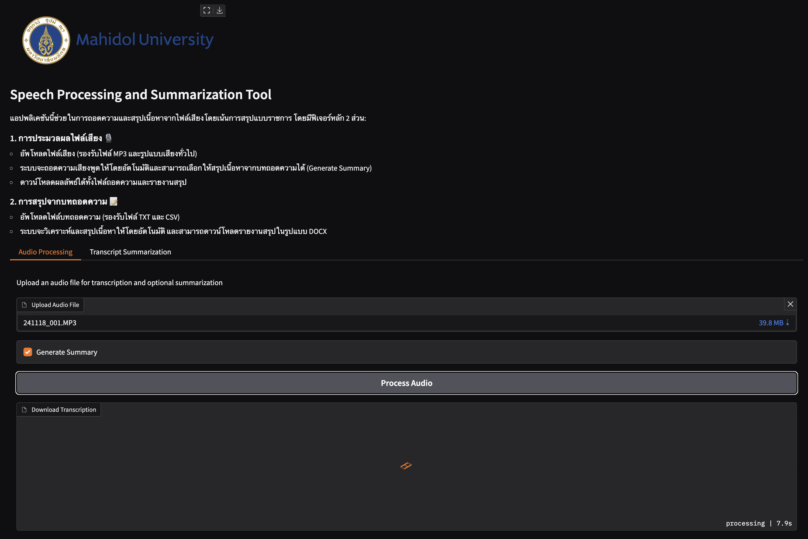

# MU Meeting Summary

Gradio application for automatic transcription and summarization of meeting recordings using Gemini API. The application generates summaries in a structured governmental report format.


## Usage

Clone the repository and install dependencies:

```sh
git clone https://github.com/biodatlab/gradio-meeting-summariser
cd gradio-meeting-summariser
pip install -r requirements.txt
```

Set up Gemini API key

```sh
export GEMINI_API_KEY="..."
```

Then, run `gradio` application with a given `app.py` file

```py
python app.py
```

Alternatively, you can run an application with specified username and password

```py
python app.py --username <yourusername> --password <yourpass>
```

## Example interface

The user can upload audio file for transcribing and summarizing an audio file.

<p align="center">
  
</p>